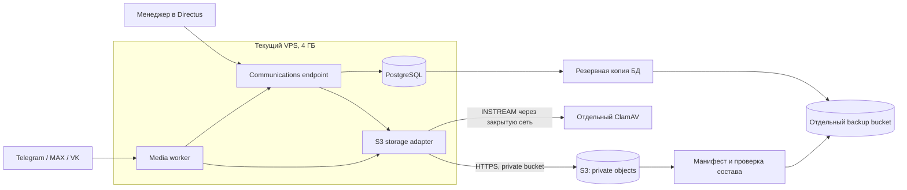

# S3 и отдельный ClamAV для омниканальных вложений

Дата решения: 14 сентября 2026 года.

## Решение

Текущий VPS продолжает запускать nginx, Directus 11.17.4, PostgreSQL, Redis и workers коммуникаций. Личные вложения Telegram, MAX и VK хранятся в отдельном приватном S3-бакете. ClamAV работает на отдельном закрытом узле и получает поток файла только на время проверки.

S3 не становится публичной файловой системой и не монтируется через `s3fs`. Модуль `packages/communications` получает нативный S3 storage adapter. Браузер, менеджер и площадки не получают ключи S3 или постоянные прямые ссылки.

Существующая библиотека Directus остаётся на локальном адаптере: на production сейчас 360 записей `directus_files` и около 125 МБ файлов. Её перенос не нужен для включения омниканальных вложений. Личные вложения продолжают учитываться в `comm_attachments`, отдельно от `directus_files`.



## Почему выбран отдельный адаптер

| Вариант | Решение |
| --- | --- |
| Сделать S3 основным хранилищем Directus | Не использовать для первого включения: смешивает публичную библиотеку и личные файлы, требует миграции существующих файлов |
| Смонтировать S3 как каталог через `s3fs` | Не использовать: файловые операции, блокировки, range-чтение и обработка ошибок становятся зависимы от FUSE-кэша |
| Нативный S3 adapter внутри communications | Выбран: сохраняет приватную модель доступа, явные состояния и независимую миграцию |

Directus поддерживает несколько S3-совместимых адаптеров через `STORAGE_LOCATIONS`, однако стандартный интерфейс загружает новые файлы в первый адаптер и хранит их в `directus_files`. Для личных коммуникаций это другая граница данных, поэтому используется отдельная серверная конфигурация.

## Разделение бакетов

Рекомендуются два приватных бакета:

1. **Live attachments** — объекты `communications/objects/<uuid>`. Доступ имеют только Directus endpoint и media-worker.
2. **Backups** — дампы PostgreSQL, манифест объектов и контрольные суммы. Учетные данные live-приложения не должны удалять резервные копии.

Созданный первым бакет целесообразно назначить для backups, потому что на production ещё нет завершённой внешней копии. Для live attachments создать второй приватный бакет. Если временно используется один бакет, разделить префиксы `live/` и `backups/`, но считать это переходным состоянием: один скомпрометированный ключ сможет затронуть и рабочие файлы, и копии.

Для Beget S3 используются endpoint `https://s3.ru1.storage.beget.cloud`, регион `ru1`, private ACL и path-style. Публичную политику и публичный поддомен для личных вложений не включать. CORS не требуется, поскольку браузер работает через авторизованный endpoint Directus.

## Конфигурационный контракт

Секреты хранятся в закрытом серверном env-файле с правами `0600` либо Docker secrets. В Git попадают только имена параметров:

```text
ISVOI_COMMUNICATIONS_STORAGE_DRIVER=s3
ISVOI_COMMUNICATIONS_S3_ENDPOINT=https://s3.ru1.storage.beget.cloud
ISVOI_COMMUNICATIONS_S3_REGION=ru1
ISVOI_COMMUNICATIONS_S3_BUCKET=<live-bucket>
ISVOI_COMMUNICATIONS_S3_PREFIX=communications/objects
ISVOI_COMMUNICATIONS_S3_FORCE_PATH_STYLE=true
ISVOI_COMMUNICATIONS_S3_ACCESS_KEY_FILE=/run/secrets/communications_s3_access_key
ISVOI_COMMUNICATIONS_S3_SECRET_KEY_FILE=/run/secrets/communications_s3_secret_key
ISVOI_COMMUNICATIONS_CLAMAV_HOST=<private-scanner-address>
ISVOI_COMMUNICATIONS_CLAMAV_PORT=3310
```

Поддержку server-side encryption включать только после проверки конкретного заголовка на Beget S3. До подтверждения нельзя считать его активным только по наличию настройки клиента.

## Поток файла

1. Endpoint проверяет полномочия, заявленный размер и лимит 20 МБ.
2. Создаётся запись вложения со случайным UUID и переходным состоянием загрузки.
3. Поток проверяется по фактическому типу, одновременно считается SHA-256 и выполняется `PutObject` в приватный S3.
4. После успешного `HeadObject` запись переходит в `quarantine`. Ошибка S3 не мешает текстовым обращениям и не создаёт состояние готового файла.
5. Media-worker получает объект как поток, повторно считает SHA-256 и передаёт содержимое ClamAV через `INSTREAM`.
6. Чистый файл переходит в `ready`; заражённый — в `rejected`, объект удаляется, а безопасные метаданные и причина сохраняются.
7. Авторизованное скачивание и browser range проходят через communications endpoint. Endpoint повторно проверяет магазин, заявку, назначение сотрудника и состояние `ready`.

Объекты имеют непредсказуемые ключи и private ACL. Оригинальное имя хранится только как метаданные БД и безопасный `Content-Disposition`. S3 key не строится из имени пользователя или площадки.

## Отдельный ClamAV

- Рекомендуемый узел: 2 vCPU, 4 ГБ RAM, постоянный том сигнатур.
- Порт `3310` доступен только с private IP/WireGuard-адреса основного VPS. Публичный listener запрещён.
- Узел не получает доступ к PostgreSQL, Directus, токенам площадок или ключам S3.
- При недоступности сканера файлы остаются в `quarantine`; текст и управление подписками продолжают работать.
- Перед включением worker проверяются готовность сигнатур, EICAR, чистый файл и восстановление прерванного состояния `scanning`.

## Изменения модели и кода

Добавочная миграция вводит для `comm_attachments` поля `storage_driver`, `storage_version` и `object_etag`. Значение старых строк — `local`. Storage interface предоставляет операции `put`, `head`, `getRange`, `getStream` и `delete`; бизнес-логика не знает файловых путей.

Текущий `readFile` заменяется потоковой проверкой. Это ограничивает память размером рабочих буферов, а не суммой одновременно проверяемых файлов. Garbage collector удаляет S3-объект только после проверки, что на него не ссылается действующая запись и нет активной резервной копии.

## Включение без потери данных

1. Проверить private policy бакета и выполнить `Put/Head/Get Range/Delete` тестового объекта с production VPS.
2. Настроить backup bucket, `rclone`, копию каждые 30 минут и первую restore-репетицию.
3. Выпустить storage abstraction с режимом `local`; поведение production не меняется.
4. Включить чтение `local+s3`, оставить запись `local`, мигрировать существующие private attachments и сверить SHA-256. Сейчас каталог практически пуст, но процедура остаётся общей.
5. Переключить новые записи на `s3`, сохранить чтение обоих драйверов и локальные оригиналы минимум семь дней.
6. Подключить отдельный ClamAV, включить media-worker только для тестового MAX-аккаунта и пройти живой сценарий каждого типа файла.
7. После сверки удалить локальные копии по retention/GC и расширять пилот по площадкам.

Откат меняет только драйвер новых записей обратно на `local`; чтение `local+s3` сохраняется. Уже записанные S3-объекты не копируются повторно и не удаляются во время отката.

## Критерии готовности

- Анонимный GET объекта из S3 запрещён.
- Секреты отсутствуют в Studio, логах, API, Git и diagnostic payload.
- Повтор загрузки не создаёт два объекта или две бизнес-записи.
- Файл сверх 20 МБ, неверный MIME и внутренний URL отклоняются.
- Чистые изображение, голосовое, аудио, видео и документ становятся `ready`; EICAR становится `rejected` и недоступен.
- При недоступном S3 загрузка получает контролируемую ошибку, а текстовые сообщения продолжают приниматься.
- При недоступном ClamAV файл остаётся в `quarantine` и автоматически проверяется после восстановления.
- Range-ответы совпадают с исходным размером и SHA-256.
- Удаление по сроку хранения не затрагивает новое обращение в том же чате.
- Восстановление БД и манифеста файлов выполняется в отдельном окружении; исходящие операции остаются на recovery hold до сверки.

При предельном расчёте один файл 20 МБ на каждое из 100 ежедневных обращений даст около 352 ГиБ за 180 дней. Поэтому отчёт объёма, срок хранения и контролируемое удаление обязательны даже при практически неограниченной емкости S3.

## Источники конфигурации

- [Directus: File Storage и S3 adapter](https://docs.directus.io/self-hosted/config-options#file-storage)
- [Directus: доступ к файлам через API](https://docs.directus.io/reference/files)
- [Beget: объектное хранилище S3, endpoint, bucket URL и private policy](https://beget.com/ru/kb/manual/obektnoe-hranilishche-s3-v-beget)
- [Beget: подключение S3 через SDK и rclone](https://beget.com/ru/kb/faq/cloud/podklyuchenie-k-obektnomu-hranilishchu-s3-pri-pomoshchi-klientov-aws-cli-s3cmd-cyberduck-sdk)
