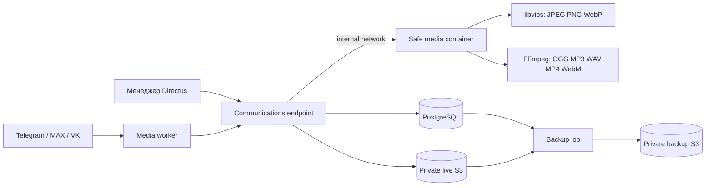

# S3 и безопасная обработка омниканальных вложений

Дата решения: 14 сентября 2026 года.

## Production-состояние

Два приватных бакета созданы и проверены. Нативный storage adapter записывает новые личные вложения в live S3; backup/restore format v3 включает эти объекты во внешнюю копию. Для текущего VPS выбран профиль safe media без ClamAV: изображения, аудио и видео полностью пересобираются в изолированном контейнере, а документы временно не принимаются.

## Граница данных

- `directus_files` и публичная библиотека сайта остаются на отдельном локальном адаптере.
- Личные вложения Telegram, MAX и VK учитываются только в `comm_attachments` и закрытом live-бакете.
- Браузер и площадки получают файл через авторизованный communications endpoint; ключи S3 и постоянные прямые ссылки им не выдаются.
- Резервные копии хранятся во втором бакете с другими учётными данными.



## Поток файла

1. Endpoint проверяет полномочия, заявленный размер, лимит 20 МБ и фактическую сигнатуру.
2. Разрешены JPEG, PNG, WebP, OGG/Opus, MP3, WAV, MP4 и WebM. GIF, PDF, TXT, DOCX, XLSX, PPTX, архивы и остальные форматы отклоняются до допуска.
3. Исходник записывается под случайным UUID в live S3 и получает состояние `quarantine`.
4. Media-worker сверяет SHA-256 и передаёт байты media-sanitizer по отдельной внутренней Docker-сети без внешнего доступа.
5. Изображение полностью декодируется и пересобирается libvips с удалением метаданных. Аудио преобразуется в OGG/Opus, видео — в MP4/H.264/AAC без дополнительных потоков и метаданных.
6. Очищенная версия записывается под новым UUID. В одной транзакции сохраняются `source_sha256`, новая `sha256`, `sanitized_at`, `sanitizer_version` и меняется указатель объекта.
7. После фиксации транзакции исходник удаляется. Неудачное удаление остаётся в `comm_file_gc` и повторяется штатной очисткой.
8. Только состояние `ready` доступно авторизованному менеджеру и исходящей доставке.

При недоступности sanitizer объект остаётся в `quarantine`; текстовые обращения продолжают работать. Ошибка декодирования, превышение размеров изображения, длительности или итогового размера переводит файл в `rejected`, а карантинный исходник ставится на удаление.

## Изоляция и ресурсы

- Контейнер запускается от UID 10001, с read-only root filesystem, `cap_drop: ALL` и `no-new-privileges`.
- Временное хранилище — tmpfs 64 МБ. Контейнер не получает томов, ключей S3, токенов площадок, доступа к PostgreSQL или Docker socket.
- Сеть sanitizer имеет `internal: true`; публичных портов нет.
- Лимиты: 1 CPU, 1 ГБ RAM, 128 процессов, одна обработка одновременно. FFmpeg, libvips и OpenMP ограничены одним потоком.
- Начальные пределы: 40 млн пикселей, 30 минут аудио, 10 минут видео, 50 секунд на один процесс. Они защищают текущий VPS от файлов с чрезмерной распаковкой.

На локальном стенде контейнер использовал около 13 МБ в простое при лимите 1 ГБ. Это позволяет использовать текущий production VPS на 4 ГБ без отдельного узла ClamAV, сохраняя последовательную очередь.

## Конфигурация

```text
ISVOI_COMMUNICATIONS_STORAGE_DRIVER=s3
ISVOI_COMMUNICATIONS_S3_ENDPOINT=https://s3.ru1.storage.beget.cloud
ISVOI_COMMUNICATIONS_S3_REGION=ru1
ISVOI_COMMUNICATIONS_S3_BUCKET=<live-bucket>
ISVOI_COMMUNICATIONS_S3_PREFIX=communications/objects
ISVOI_COMMUNICATIONS_S3_FORCE_PATH_STYLE=true
ISVOI_COMMUNICATIONS_S3_ACCESS_KEY_FILE=/run/secrets/communications_s3_access_key
ISVOI_COMMUNICATIONS_S3_SECRET_KEY_FILE=/run/secrets/communications_s3_secret_key
ISVOI_COMMUNICATIONS_SANITIZER_URL=http://media-sanitizer:8080
```

## Практические границы

Полное пересоздание разрешённых медиа заметно уменьшает поверхность атаки и не выпускает клиентский оригинал. Этот механизм не является сигнатурным антивирусом и не даёт права безопасно раздавать произвольные оригинальные документы. Для DOCX/XLSX/PPTX, архивов и оригинальных PDF потребуется отдельный антивирусный или CDR-сервис. Для PDF можно позднее добавить режим просмотра, который отрисовывает страницы в изображения и не выдаёт оригинал.

## Критерии готовности

- Анонимный GET из live S3 возвращает отказ.
- Секреты отсутствуют в Studio, логах, API, Git и diagnostic payload.
- Все разрешённые типы проходят реальное декодирование и повторное кодирование.
- Исходная и итоговая SHA-256 различаются и сохраняются для аудита.
- Повреждённые файлы и документы не становятся `ready`.
- Сбой S3 или sanitizer не останавливает текстовые обращения.
- В S3 после успешной обработки остаётся только очищенный объект; `comm_file_gc` не накапливает постоянный хвост.
- Backup/restore восстанавливает БД, live S3 и манифест контрольных сумм.

При предельном расчёте один файл 20 МБ на каждое из 100 ежедневных обращений даст около 352 ГиБ за 180 дней. Поэтому отчёт объёма, срок хранения и контролируемое удаление обязательны.
