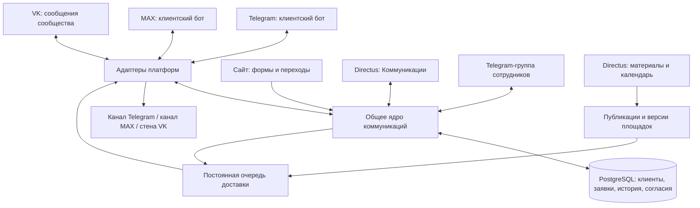

# Омниканальная структура ISVOI — предложение

Дата: 6 сентября 2026 года. Статус: предложение к обсуждению, не описание внедрённой системы.

Повторная проверка best practice: 6 сентября 2026 года. Уточнены гарантии обработки, доступ к истории, восстановление, миграция и условия приёмки в разделе 15; соответствующие правила внесены в основные разделы. Документ задаёт проектные требования. Их выполнение подтверждается испытаниями реализации, а не наличием описания.

Основание: задача «Telegram лиды + канал» (`01a0678e-a41f-7f21-a6d6-a7d2e0b61a29`), текущие документы и код проекта, официальная документация платформ. Production в рамках этой проработки не проверялся и не изменялся. Сведения о работающих функциях ниже взяты из зафиксированных релизов проекта.

## 1. Рекомендуемое решение

Развивать существующую связку Directus + PostgreSQL в единый центр коммуникаций ISVOI. Telegram, MAX и VK подключать через отдельные адаптеры к общим правилам обработки заявок, идентификации клиентов, назначения сотрудников, подписок и доставки.

Основной рабочий интерфейс — модуль «Коммуникации» внутри Directus. Настройки, каталог, заявки, контент, сотрудники и роли остаются в существующей системе. Telegram-группа сохраняется как дополнительный интерфейс уведомлений и быстрых действий. Для MAX и VK не требуется делать обязательным посредником Telegram.

На старте — один клиентский бот бренда на каждой платформе, один публичный ресурс бренда на площадку и маршрутизация по городам внутри общей системы. Отдельные боты для покупки, обмена, поддержки или каждого города пока не нужны. Права публичного издателя и клиентского обслуживания разделяются логически; отдельные технические подключения для публикаций можно вводить там, где это поддерживает платформа и оправдывает управление доступом.

Это рекомендация для текущего проекта: один действующий магазин/маршрут, уже реализованная собственная логика заявок и доступная поддержка разработки. Число операторов, поток сообщений и бюджет сопровождения не установлены. При необходимости немедленного запуска большой операторской команды экономику решения нужно сравнить с готовой платформой.

| Вариант | Преимущества | Цена решения | Вывод |
| --- | --- | --- | --- |
| Общая Telegram-группа для всех входящих | Быстро развивает MVP | Работа сотрудников зависит от одной внешней платформы; сложнее права, поиск и SLA; требуется перенос клиентских вложений между платформами | Временный дополнительный интерфейс |
| Готовая омниканальная платформа + Directus | Готовое рабочее место операторов | Интеграция идентификаторов, статусов, согласий и истории; регулярная оплата; проверка возможностей каждого подключения | Альтернатива при приоритете скорости запуска операторов |
| Directus + собственное общее ядро и адаптеры | Единая модель заявок, товаров, подписок и прав; постепенная миграция MVP | Нужно разработать интерфейс общения и сопровождать API трёх платформ | Рекомендуемый путь при текущих вводных |

Например, Teletype заявляет общую панель и подключения Telegram bot, VK и MAX. Это кандидат для сравнительного пилота, а не проверенная замена нашей системы. Нужны испытания именно официальных ботов, экспорт истории, webhook/API, назначение сотрудников, отзыв подписок и правила обработки данных. Наличие интеграции мессенджера не доказывает наличие редакционного календаря публичных каналов. [Панель и подключения Teletype](https://teletype.app/help/knowledge-base/chto-takoe-teletype-app/), [API Teletype](https://teletype.app/help/api/).

## 2. Три разных процесса

| Процесс | Назначение | Единица учёта | Управление |
| --- | --- | --- | --- |
| Личные обращения | Подбор, покупка, продажа/обмен, поддержка | Клиент → заявка → диалог → сообщение | Очередь менеджеров, назначение, сроки ответа |
| Персональные рассылки | Поступления, снижение цен, новости по подписке | Кампания → получатель → доставка | Темы согласий, предпочтения, ограничения частоты |
| Публичные публикации | Контент каналов и сообщества | Материал → версия для площадки → публикация | Календарь, проверка, расписание, модерация |

Один материал может использоваться в нескольких процессах, но публикация в канале не создаёт персональных отправок и не записывает всех подписчиков канала в клиентскую базу. Подписка на публичный канал, разрешение платформы писать пользователю и подписка на персональную рекламную тему — отдельные признаки.

## 3. Логическая схема

Схема логическая: ядро не требует отдельного набора микросервисов. На первом этапе достаточно модульного серверного кода в существующем проекте и фоновых процессов доставки с PostgreSQL. Вынос в отдельный сервис нужен при самостоятельных требованиях к нагрузке и выпуску.

## 4. Что уже можно переиспользовать

В проекте зафиксированы рабочие заявки и двусторонняя переписка через `@isvoi_help_bot`, привязка заявки сайта одноразовой ссылкой, назначения сотрудников, авторство действий, постоянная очередь, дедупликация и обработка неопределённой отправки. Подписки и кампании описаны как выпущенный закрытый пилот; публичный канал ещё не подключён.

Источники проекта: `docs/telegram-client-conversations.md`, `docs/telegram-bot-notifications.md`. Ранний `docs/telegram-leads-stage1.md` отражает первый этап, поэтому его формулировки об отсутствии клиентской переписки уже не описывают последующие релизы.

Точки, которые нельзя просто скопировать для новых платформ:

- `lead_conversations` содержит обязательные `bot_id`, `client_user_id`, `client_chat_id`, связь с `telegram_routes` и уникальность `(lead_id, bot_id)`.
- `lead_messages` содержит `telegram_message_id` и `photo_file_id` Telegram.
- `telegram_client_sessions` предполагает `chat_id=user_id`.
- `telegram_message_outbox` и текущий worker привязаны к Telegram и одному lease на бота.
- `leads.telegram_unread` не заменяет состояние прочтения каждым сотрудником и очередь ожидающих ответа.

Следовательно, обобщение включает данные, контракты и поведение. Переименование таблиц или добавление одного поля `platform` недостаточно.

## 5. Подключения платформ

| Платформа | Личные обращения | Публичный контент | Условия |
| --- | --- | --- | --- |
| Telegram | Существующий бот, меню, диалоги | Канал, где бот имеет необходимые права | Проверка владельца ресурса, chat ID, прав публикации и обработки ошибок |
| MAX | Бот организации, адаптер событий и отправки | Канал с правами бота | Доступ к партнёрскому профилю, проверка бота, webhook и реальный пилот |
| VK | Бот на базе сообщений сообщества | На первом этапе — стена сообщества | Раздельная проверка прав на сообщения и публикации |

Telegram Bot API поддерживает отправку в каналы и права администратора на публикацию. Техническая возможность написать пользователю не заменяет учёт его подписки. [Telegram Bot API](https://core.telegram.org/bots/api), [Telegram FAQ](https://core.telegram.org/bots/faq).

Доступная на дату проверки документация MAX требует webhook для production и описывает отправку сообщений в чаты/каналы. В ней также указаны актуальный адрес API и требования к сертификатам: при реализации их нужно проверить в среде размещения, сохраняя проверку TLS. Это отдельная проверка готовности, а не основание переносить настройки Telegram. [Обзор MAX API](https://dev.max.ru/docs-api).

Для создания бота MAX требуется верифицированный профиль организации, ИП или самозанятого. Доступность ресурсов именно ISVOI ещё не проверена. [Создание ботов MAX](https://dev.max.ru/help/chatbots).

В официальной схеме VK есть `messages.send`, механизм разрешения сообщений от сообщества и отдельный `wall.post`. Для `wall.post` просмотренная схема перечисляет пользовательский токен; нельзя предполагать, что ключ бота для сообщений автоматически даёт публикацию. Конкретную схему доступа необходимо подтвердить на тестовом сообществе. [Схема сообщений VK](https://github.com/VKCOM/vk-api-schema/blob/master/messages/methods.json), [Схема публикаций VK](https://github.com/VKCOM/vk-api-schema/blob/master/wall/methods.json).

**«Канал VK» внутри мессенджера не приравнивается к стене сообщества.** Поддержку его автоматической публикации по доступным официальным источникам подтвердить не удалось. Если нужен именно такой ресурс, предусмотреть отдельное назначение `vk_channel`: сначала ручная публикация из подготовленного материала с фиксацией ссылки, автоматизация после проверки поддерживаемого API. Для стены используется `vk_wall`.

Для каждого подключения хранить реестр возможностей: текст, фото, кнопки, редактирование, удаление, публичная публикация, статусы доставки и прочтения, ограничения файлов и частоты. Интерфейс предлагает только подтверждённые функции. Неподдерживаемые форматы сохраняются как событие и объясняются пользователю; исчезать без следа они не должны.

## 6. Клиент и переход между мессенджерами

У клиента может быть несколько аккаунтов и несколько заявок. Постоянная переписка с ботом (`channel_threads`) существует независимо от заявки. Отдельное обсуждение заявки (`conversations`) связывает эту переписку с конкретной задачей клиента. Одна заявка может обсуждаться на нескольких площадках, а один постоянный чат — последовательно обслуживать несколько заявок. История для сотрудника единая, но каждое сообщение сохраняет исходный канал, автора, время, адресата и принадлежность к заявке, если она определена.

Пример: человек оставил заявку на сайте, подключил Telegram, затем выбрал «Продолжить в MAX». После подтверждения связи MAX добавляется к той же заявке; ответственный и этап продажи сохраняются. Новое самостоятельное обращение этого же человека может стать отдельной заявкой.

Правила идентификации:

- На первом обращении создаётся предварительная карточка и идентификатор в конкретном подключении. Уникальный ключ — `(platform, connection_id, external_user_id)`, а не имя или username.
- Объединение доступно через авторизованный кабинет с повторным подтверждением личности или одноразовое приглашение из уже подтверждённого диалога. Для приглашения подтверждение в исходном диалоге обязательно до открытия существующей истории новому аккаунту. Ссылка сама по себе не доказывает владение обоими аккаунтами.
- Приглашение имеет короткий срок, хранится в виде хеша, используется один раз и привязано к назначению. В URL не передаются телефон, текст обращения и открытый идентификатор клиента.
- Совпадение введённого телефона, имени, аватара или username — повод предложить проверку, но не доказательство общей личности. Общие семейные номера требуют отдельного рассмотрения.
- Связь и её отмена журналируются; ошибочное объединение должно быть обратимым. Новая личность не получает автоматически список старых заявок до подтверждения.
- Удаление связи аккаунтов не возвращает ранее отозванные согласия и не уничтожает историю заявок произвольно.

Связать аккаунты, разрешить продолжение конкретной заявки и разрешить просмотр прежних заявок — разные действия. История открывается в пределах явно подтверждённого доступа, а не автоматически по всей объединённой карточке. Разрыв связи отменяет неиспользованные приглашения и доступ через отвязанный аккаунт; предстоящие отправки требуют повторной проверки адресата. Внутренние заметки сотрудников не экспортируются в клиентские боты.

Ответ по умолчанию идёт в диалог, из которого пришло сообщение. При явном переходе клиента меняется активный канал. В форме ответа всегда видны площадка и получатель; устаревший черновик после переключения требует перепроверки. Копирование ответа одновременно в три мессенджера не является стандартным поведением.

Без подтверждённой связи аккаунтов система не может гарантировать устранение дублей между платформами. Это ограничение нужно сохранять и в аналитике.

## 7. Рабочее место и управление

Directus допускает отдельные модули интерфейса, поэтому «Коммуникации» можно сделать внутри текущей админки, сохранив учётные записи и серверные права. Это новая разработка; обычные таблицы Directus сами по себе не дают удобный операторский чат. [Модули Directus](https://directus.com/docs/guides/extensions/app-extensions/modules).

### Экран обращений

Три области: слева очередь, в центре переписка, справа клиент и заявка. Основные действия: взять в работу, ответить, внутренняя заметка, передать, ждать клиента, завершить, открыть связанную заявку.

Фильтры: новые, мои, неназначенные, ожидают ответа сотрудника, ожидают клиента, просроченные, площадка, город, тип обращения. Отметка «прочитано сотрудником» и состояние «клиенту ещё не ответили» независимы.

Форма внешнего ответа и внутренняя заметка визуально разделены. Ответ из браузера и ответ из Telegram используют одни серверные команды и проверки. Назначение атомарно: два сотрудника не могут одновременно успешно взять свободную заявку. Перед отправкой повторно проверяются сотрудник, права, назначение и адресат.

### Правила маршрутизации

Порядок: подтверждённая заявка и её магазин → явно выбранный город → категория → доступная команда. Для неизвестного города первоначально сохраняется действующий маршрут Белгорода. Позже можно добавить общую очередь уточнения города.

Сохранять назначенного сотрудника при смене канала. Для новых обращений начать с общей очереди и «Взять в работу»; автоматическое распределение по доступности добавлять после появления устойчивого графика и данных о нагрузке.

Предлагаемые стартовые нормативы, а не текущая статистика: первый человеческий ответ до 10 минут в рабочее время, предупреждение руководителю через 15 минут. Значения настраиваются по команде. Автоприветствие не закрывает норматив; вне рабочего времени клиент получает часы и ожидаемый срок. Нужны отдельные таймеры первого ответа, следующего ответа и длительности ожидания клиента.

### Разделы управления

| Раздел | Содержание |
| --- | --- |
| Входящие | Обращения, история, назначение, сроки ответа |
| Клиенты | Подтверждённые аккаунты, заявки, предпочтения связи |
| Подписки | Темы, согласия, отказы, ограничения частоты |
| Контент и календарь | Материалы, версии для площадок, расписание |
| Кампании | Аудитории, тесты, проверка, доставка |
| Подключения | Ресурсы, проверенные права, состояние webhook, ошибки |
| Правила и отчёты | Маршруты, графики, шаблоны, результаты и техническое состояние |

### Роли

Менеджер обслуживает доступные ему заявки; редактор готовит материалы и тестирует; ответственный за маркетинг утверждает и запускает кампании; руководитель управляет очередью и правилами; администратор подключает ресурсы и выдаёт права. На старте один человек может совмещать несколько ролей, но запуск, авторство и изменения всё равно фиксируются.

Технические идентичности адаптеров имеют минимальные права. Секреты не отображаются редакторам и не попадают в браузер. В Directus хранятся ссылки на секреты и статус проверки подключения. Владелец бренда сохраняет контроль над аккаунтами, ресурсами и восстановлением доступа.

## 8. Контент, подписки и публикации

Редактор создаёт единый материал: тема, текст, медиа, связанные товары, актуальность предложения. Затем формирует версии для Telegram, MAX и VK с допустимыми форматами, кнопками и длиной. Отдельно выбирает назначения: публичный ресурс и/или персональная аудитория.

Процесс: черновик → предпросмотр каждой версии → тест → проверка → утверждение → расписание → независимые результаты назначений. Утверждённое содержание фиксируется снимком; существенное изменение требует нового утверждения. Перед отправкой товарного предложения проверяются срок действия и доступность товара. Устаревший материал приостанавливается, а не меняется незаметно.

Система показывает: Telegram опубликовано; MAX ошибка; VK запланировано. Повторяется только проблемное назначение. Успешные публикации не откатываются автоматически из-за ошибки другой площадки. Для каждой сохраняются внешние идентификаторы и доступная ссылка; ручная публикация тоже имеет автора и время.

Комментарии относятся к модерации публичного контента. Они могут стать поводом для ответа или предложения перейти в бот; не каждый комментарий становится лидом. Контактные данные и обсуждение конкретной заявки переводятся в личный диалог. Связь комментария с материалом и источником обращения сохраняется при технической возможности.

Персональные рассылки:

- Согласие хранится по теме, назначению и каналу с версией текста и источником. Связывание аккаунтов не переносит его автоматически.
- Для подтверждённого клиента по умолчанию выбирается один предпочтительный разрешённый канал кампании. Дополнительные каналы — только по явной настройке подписчика.
- Сохранить стартовую политику MVP: маркетинговое окно 10:00–20:00 МСК и не более двух персональных маркетинговых сообщений за скользящие семь дней. Сделать её общей для подтверждённого клиента, а не отдельной на каждого бота.
- До каждой отправки повторно проверяются согласие, блокировка, актуальность, общий лимит и отмена кампании. Снимок аудитории не отменяет новый отказ.
- При конкурентной отправке бюджет частоты резервируется транзакционно. Неопределённые отправки удерживают резерв до решения, иначе разные workers смогут превысить лимит.
- Отказ отменяет ещё не отправленные задания. Уже переданное платформе сообщение нельзя гарантированно отозвать; эта граница должна быть честно отражена в интерфейсе.
- Автоматическая запасная доставка в другой канал возможна только при подтверждённой связи, разрешении на этот канал и однозначной недоставке. При `uncertain` переключение также может создать дубль и не выполняется автоматически.
- Сервисные ответы по заявкам имеют отдельную политику и более высокий приоритет. Публичные публикации не входят в персональный лимит; их частота регулируется календарём.

Для входящего потока в каждом боте сохранить единые действия: купить/подобрать, продать/обменять, задать вопрос, мои заявки, подписки. Первый содержательный вопрос сохраняется сразу, открытие меню не создаёт пустой лид. Сценарии и тексты управляются централизованно с допустимыми различиями платформ.

## 9. Целевая модель данных

Названия ниже — предложение, миграции ещё не созданы.

| Сущность | Ответственность |
| --- | --- |
| `contacts` | Внутренняя карточка клиента |
| `channel_connections` | Бот/сообщество, владелец, платформа, секрет, возможности |
| `channel_destinations` | Публичный канал, стена, служебная группа |
| `contact_identities` | Аккаунт клиента в конкретном подключении, статус подтверждения |
| `identity_link_events` | История связывания и отмены связей |
| `leads` | Существующие заявки, статус, магазин, ответственный |
| `channel_threads` | Постоянная переписка в подключении с внешним peer, независимая от заявок |
| `conversations` | Обсуждение конкретной заявки в постоянном чате; состояние обслуживания |
| `messages` / `message_attachments` | История сообщений постоянного чата, необязательная связь с обсуждением заявки, закрытые вложения |
| `conversation_reads` | Позиция прочтения конкретного сотрудника |
| `routing_rules` / `communication_templates` | Маршрутизация, часы, шаблоны ответов |
| `subscriptions` / `consent_events` | Текущее согласие по теме/каналу и неизменяемый журнал; техническая доступность аккаунта хранится отдельно |
| `content_items` / `content_variants` | Общий материал и версии для площадок |
| `campaigns` / `campaign_targets` | Запуск, аудитория, назначения, снимок утверждения |
| `publications` | Результат публикации и внешние идентификаторы |
| `inbound_events` / `delivery_outbox` | Постоянный журнал входящих событий и логические задания отправки |
| `delivery_operations` | Фактические API-операции задания, последовательность, внешние ID и результат каждой части |
| `command_receipts` | Ключи повторных команд, контроль совпадения параметров и сохранённые результаты |
| `delivery_attempts` / `audit_events` | Попытки доставки и действия сотрудников |
| `communication_events` / `audience_daily` | Версионированные события для аналитики и пересчитываемые дневные агрегаты |

Внешние идентификаторы хранить как строки, чтобы не навязывать ограничения Telegram другим платформам и не терять точность больших чисел. Их уникальность всегда рассматривается в области соответствующего подключения/диалога. Медиа содержат тип, размер, внутреннюю ссылку и идентификатор платформы; Telegram `file_id` нельзя отправить в MAX или VK.

Новые закрытые вложения доступны только через авторизованный серверный доступ. Для существующих Telegram-фотографий можно сохранить получение через сервер по `file_id`; массовое копирование в публичную библиотеку не требуется. При необходимости межплатформенной отправки сервер получает разрешённое вложение и загружает его в целевую платформу. Действует срок хранения из политики переписки.

## 10. Надёжность и эксплуатация

Входящий webhook сначала проверяет подлинность, подключение и допустимый размер запроса, затем надёжно записывает событие; успешное подтверждение платформе выдаётся после записи. Загрузка вложений и бизнес-обработка выполняются после подтверждения отдельной задачей. Повтор уже сохранённого события получает успешное подтверждение без нового эффекта. Обработчик атомарно сохраняет бизнес-изменение, исходящие задания и отметку обработки входящего события. Ошибка откатывает их вместе.

Это развитие существующего transactional outbox: изменение заявки и намерение отправить сообщение фиксируются в одной транзакции. Он решает проблему рассогласования записи и отправки, но сам по себе не гарантирует единственную внешнюю доставку. [Описание паттерна AWS](https://docs.aws.amazon.com/en_en/prescriptive-guidance/latest/cloud-design-patterns/transactional-outbox.html).

Правила реализации:

- Стабильные ключи дедупликации входящих событий, операций сотрудников и заданий. Для команды ключ связан с автором, типом операции и параметрами: повтор тех же параметров возвращает прежний результат, изменение параметров с тем же ключом отклоняется. Для VK использовать поддерживаемый `random_id` в области и пределах гарантий API. Для других операций не выдумывать внешнюю идемпотентность.
- Отдельные лимиты и изоляция ошибок на подключение. Медленный MAX не блокирует Telegram/VK. Исходящие операции получают последовательность внутри постоянного чата: обсуждения разных заявок в одном peer не обходят этот порядок. Для входящих сохраняются время платформы, время получения и доступные номера последовательности; глобальный порядок между платформами не предполагается. Зависимые операции не обгоняют создание ресурса.
- Поддержка и служебные операции имеют приоритет над маркетингом. Планировщик задаёт квоты, чтобы большая кампания не ухудшала время ответа.
- Workers получают задания с lease, уникальным ID попытки и версией владения; сетевой запрос не держит долгую транзакцию БД. Просроченная операция отправки с неизвестным исходом переводится на сверку, а не выдаётся повторно другому worker. Запоздалый результат сохраняется как свидетельство попытки и обрабатывается без затирания более нового состояния. Lease защищает координацию в БД, но сам по себе не отменяет уже ушедший внешний HTTP-запрос.
- `429` учитывает указания API; определённые временные ошибки повторяются с ограниченной задержкой и случайным разбросом. Постоянная ошибка отправляется на разбор. После сетевого таймаута создания сообщения возможен `uncertain`, а не слепой повтор.
- Ошибки классифицируются по платформе, методу и содержимому ответа: запрет пользователем, неверный ключ, утрата прав бота, неподдерживаемый формат, лимит, временный сбой, неизвестный исход. HTTP 403 не является универсальным признаком отписки. Ошибка прав канала приостанавливает соответствующее назначение и уведомляет администратора, не меняя согласия клиентов.
- Статусы: очередь, отправка, принято платформой, ошибка, заблокировано, отменено, ограничено политикой, результат неизвестен. Доставлено/прочитано добавляются только при реальном подтверждении платформы; отсутствие данных отображается как неизвестность.
- Независимые выключатели: подключение целиком, персональный маркетинг, публичные публикации. Отключение кампаний не выключает ответы клиентам.
- PostgreSQL достаточно для первой очереди. Дополнительный брокер вводить по измеренной нагрузке, а не ради количества интеграций.

MAX рекомендует проверять `X-Max-Bot-Api-Secret` для webhook. Для Telegram и VK адаптеры также проверяют соответствующие механизмы платформ, идентификаторы ресурсов и схему события; нельзя принимать произвольный JSON как доверенное сообщение клиента. [Webhook MAX](https://dev.max.ru/docs-api/methods/POST/subscriptions).

Мониторинг: возраст самого старого задания, задержка обработки входящих, время доставки p50/p95 с размером выборки, ошибки и `uncertain`, состояние подключения, необработанные обращения, соблюдение нормативов ответа. Аварийные уведомления должны иметь путь, независимый от Telegram, например в рабочем интерфейсе и настроенной корпоративной почте.

Восстановление: резервная копия БД и проверка восстановления, документированная смена ключей, перезапуск workers, повторная обработка сохранённых событий без дублей. Логи не содержат токены, одноразовые приглашения и полный текст личной переписки.

После восстановления более старой БД доставка по умолчанию приостановлена. До включения сверяются выполненные внешние операции, отказы от подписок, удаления данных и журнал после точки восстановления. При отсутствии достоверной сверки спорные отправки остаются запрещены, а результаты — неизвестными. Старый backup не должен автоматически возобновить отозванную подписку или повторить уже отправленную кампанию. Процедура восстановления предусматривает повторное применение актуальных требований удаления к восстановленным данным.

Уже согласованный в MVP срок хранения переписки — шесть месяцев после закрытия заявки — сохранить при миграции, включая копии вложений и поисковые индексы. Журналы согласий и резервные копии требуют своей явно зафиксированной политики; их нельзя автоматически приравнять к сроку переписки. Очистка собственной базы не означает гарантированное удаление копий на внешних платформах.

## 11. Аналитика

Общая цепочка: материал/источник → переход → содержательное обращение → квалифицированная заявка → результат продажи.

Сохранять `campaign_id`, `content_variant_id`, `source_platform`, `source_destination`, неперсональные метки перехода, первый и последний известный источник. Предпочитать переход в бот той же площадки. Для привязки заявки использовать отдельный защищённый механизм; публичный код кампании не должен открывать заявку.

Считать отдельно число аккаунтов, подтверждённых клиентов, заявок и сообщений. Показывать долю неподтверждённых связей, чтобы не выдавать сумму пользователей трёх площадок за уникальную аудиторию. Не приписывать просмотры и прочтения там, где API их не сообщает. Конверсия в продажу достоверна в пределах качества заполнения результата заявки; без рекламных расходов не считать стоимость привлечения.

## 12. Последовательность внедрения

| Этап | Результат | Критерий готовности |
| --- | --- | --- |
| 0. Проверка ресурсов | Владельцы ботов/сообществ, доступ MAX, точный тип ресурса VK, перечень возможностей | Проверены права и тестовые ресурсы; пробелы явно записаны |
| 1. Общее ядро и Telegram | Новая модель, совместимый Telegram-адаптер, минимальный экран входящих Directus, события и базовые показатели аудитории | Текущие сценарии работают без потери истории и повторных отправок; повтор события не меняет счётчики |
| 2. MAX и VK | Единые обращения и ответы через официальные подключения; новые маркетинговые рассылки пока выключены | По одному полному сценарию сайт/прямое обращение → назначение → ответ → закрытие в каждой платформе |
| 3. Единый клиент и подписки | Подтверждённая связь аккаунтов, предпочтения, общий лимит | Переход не создаёт дубликат заявки; отказ и частотный лимит проверены между платформами |
| 4. Публичные ресурсы | Календарь, версии, независимые результаты публикаций | Ошибка одного назначения не повторяет успешные публикации других |
| 5. Развитие | Модерация, сегменты, товарные триггеры, расширенная аналитика когорт и результатов | Измерены нагрузка, соблюдение сроков и качество данных |

Проверку доступа MAX начать сразу, чтобы внешняя регистрация не задержала готовую интеграцию. Порядок подключения MAX/VK можно поменять по готовности ресурсов.

Миграция Telegram — добавлением новой схемы и таблицы соответствий, с сохранением текущих ID, назначения, состояния подписок, ключей дедупликации и неотправленной очереди. Сначала проверить миграцию на копии и сверить объём/связи. При переключении остановить старый потребитель, зафиксировать его offset и in-flight операции, запустить одного владельца отправки. Не запускать два worker для одних событий и не включать polling одновременно с webhook одного бота.

После переключения откат должен учитывать уже принятые новым контуром сообщения. Простой возврат старой базы потеряет их; поэтому требуются совместимость периода перехода, сохранение новых событий и отдельный регламент. Старые таблицы удалять только после стабильной работы и сверки.

Обязательные испытания: повтор webhook; конкурентное назначение; отзыв прав сотрудника перед отправкой; неправильная/истёкшая ссылка; попытка доступа к чужой заявке; переход канала при открытом черновике; перезапуск во время отправки; `429`; неизвестный исход; конкурентный частотный лимит; отзыв согласия перед отправкой; изоляция медиа; ошибка одной публичной площадки; восстановление БД.

Следующий конкретный пакет работ — техническое задание на общее ядро, совместимость Telegram и минимальное рабочее место Directus. До оценки сроков нужны объём диалогов, число одновременно работающих менеджеров, требования к мобильному интерфейсу, доступность MAX/VK и перечень обязательных вложений. Эти неизвестные влияют на объём реализации, но не мешают выбрать предложенные границы системы.

## 13. Аналитика аудитории ботов

Дополнение по вопросу пользователя о количестве подписчиков. Это требования к будущему разделу «Аудитория», а не уже реализованный общий дашборд и не фактические числа ISVOI.

### Показатели и определения

| Показатель | Правило расчёта |
| --- | --- |
| Учтённые пользователи бота | Уникальные внешние аккаунты, начавшие личное взаимодействие и зарегистрированные системой, в пределах подключения. Повторный Start не добавляет пользователя |
| Новые пользователи | Первое зафиксированное личное взаимодействие в выбранном периоде; возвращение после остановки отдельно |
| Подписчики рассылок | Уникальные аккаунты с действующей подпиской хотя бы на одну тему. Три темы одного аккаунта дают одного подписчика |
| Подписчики по темам | Уникальные подписчики каждой темы. Столбцы тем пересекаются и не складываются в общее число людей |
| Доступность связи | Отдельные группы: разрешена по последним сведениям, известная блокировка/запрет, состояние неизвестно. Показывать время последнего подтверждения |
| Получатели конкретной кампании | Подписаны на нужную тему, удовлетворяют сегменту, не имеют запрета, прошли политику частоты и выбор предпочтительного канала; окончательная проверка непосредственно перед отправкой |
| Активные за 7/30 дней | Уникальные аккаунты с входящим сообщением, командой или нажатием callback в периоде. Исходящая рассылка и её принятие платформой не являются активностью пользователя |
| Отказы от рассылок | Уникальные аккаунты, отключившие последнюю активную тему. Отказ от одной темы учитывается отдельно |
| Остановки/блокировки | Изменение технической доступности, отдельное от явного отказа через меню подписки |
| Возвращения | Возобновление общения или подписки ранее известным аккаунтом; не считать новым привлечением |

Текущее число учтённых аккаунтов и историческое число первых взаимодействий имеют разные правила хранения. Очистка старых сессий не должна выглядеть как отписка. Нужны дневные агрегаты, классификация причин изменения базы и явно заданный период наблюдения. После удаления идентификаторов повторно пришедшего человека иногда невозможно распознать как прежнего; отчёт не должен обещать пожизненную уникальность.

### Что будет видно руководителю

Первый экран — сравнительная таблица Telegram / MAX / VK: учтённые пользователи, подписчики хотя бы одной темы, активные за 30 дней, новые и возвращённые за период, отказы, известные блокировки, доля неизвестной доступности. Сверху фильтр периода и дата актуальности данных.

График роста: подписчики на начало и конец дня, вступления в аудиторию рассылок, возвращения, выходы и технические/учётные корректировки. Формула баланса применяется к одной определённой аудитории: конец = начало + входы − выходы + корректировки. Событие блокировки не вычитается повторно, если уже привело к выходу из этой аудитории. Нельзя смешивать прирост всех пользователей бота и прирост согласившихся на рассылки.

Разрезы: площадка, тема подписки, источник перехода, город при наличии, кампания, месяц первого обращения. Для источников сохраняется группа «неизвестен»; география не выводится из имени или внешнего аккаунта без данных клиента.

Воронка: отслеженный переход → начало общения → подписка → содержательное обращение → успешная заявка. Переход доступен только при собственной измеримой ссылке/инструментации; простое открытие профиля бота не равно старту и может быть недоступно. Этапы считаются для одной когорты с заданным окном, например 30 дней после первого общения. Обращение не обязательно требует подписки: в интерфейсе также показывается самостоятельная ветка обслуживания без маркетинга.

По кампании: отобрано, исключено политикой, передано платформе, однозначные ошибки, неизвестный исход, измеренные переходы, связанные обращения и продажи. Для каждой конверсии показывать знаменатель и окно атрибуции. Переходы через размеченные ссылки не равны прочтениям; автоматические предпросмотры и боты могут искажать клики. Достоверное прочтение показывается только при наличии соответствующих данных платформы.

### Общая аудитория трёх платформ

Сумма аккаунтов ботов не является числом уникальных людей. В общей карточке показывать отдельно аккаунты, подтверждённые объединения и число профилей после известных объединений с долей неподтверждённых связей. Для рассылок считать объединение именно согласившихся и подходящих под правила аккаунтов. Даже после известных объединений остаточные дубли возможны; показатель нельзя подписывать «точное число людей».

Подписчики публичных каналов/сообщества — отдельная вкладка. Их агрегированные размеры, где доступны, не складываются с аудиторией ботов в уникальный охват. Показатель пересечения канала и бота строится только для тех известных аккаунтов, для которых есть допустимое подтверждение членства; полный список подписчиков автоматически не предполагается.

### Источники данных и ограничения

Основной источник — собственный реестр событий и подписок. В Telegram изменение `my_chat_member` в личном чате сообщает блокировку/разблокировку. `getChatMemberCount` относится к участникам чата/канала и не даёт общую базу пользователей бота. [Telegram Bot API](https://core.telegram.org/bots/api).

MAX описывает события `bot_started` и `bot_stopped`; повторный запуск может быть возвращением прежнего пользователя, поэтому счётчик событий не равен числу новых людей. [События MAX](https://dev.max.ru/docs-api/objects/Update).

В VK можно проверять разрешение сообщений сообщества для известного пользователя; членство в сообществе и согласие на нашу тематическую рассылку учитываются независимо. [Схема API сообщений VK](https://github.com/VKCOM/vk-api-schema/blob/master/messages/methods.json).

Отсутствие события блокировки не гарантирует возможность доставки. Потери webhook, отсутствие исторических событий и устаревшие сведения отражаются в качестве данных. Проверочные рассылки всей базе ради подсчёта доступных пользователей не нужны.

В текущем Telegram-коде уже есть сессии, тематические подписки, журнал изменений и результаты кампаний — основа для части показателей. Полный событийный учёт аудитории, источников, активности, исторические снимки и межплатформенная дедупликация требуют реализации. Существующие данные загружаются как начальный снимок; отсутствующие даты и история не выдумываются. Тестовые, служебные и пилотные аккаунты выделяются и исключаются из бизнес-показателей по умолчанию.

## 14. Уточнения после архитектурного пересмотра

Эти решения дополняют предложение и уточняют модель выше. Приоритет P0 — заложить до подключения второй платформы; P1 — реализовать до соответствующего публичного запуска; P2 — развитие по результатам эксплуатации. Обозначения задают порядок, а не оценку серьёзности дефектов production.

### 14.1. Отделить постоянный чат от заявки — P0

Пример: в сентябре клиент спрашивает о покупке, в октябре продаёт старый телефон, в ноябре обращается за поддержкой. Это один аккаунт и постоянный чат, но три разных обращения. Маркетинговое меню и команды подписки также живут в этом чате и не требуют заявки.

Модель раздела 9 уточнена: `channel_threads` хранит адрес переписки; `conversations` — обсуждение заявки в ней. Входящее сообщение сначала сохраняется в постоянном чате. Затем его относят к выбранной заявке или создают новое обращение по существующим правилам MVP. Если одновременно открыто несколько заявок и адресат обсуждения неясен, сообщение сохраняется в очереди уточнения; бот или менеджер уточняет контекст без просьбы повторно прислать текст.

Существующее поведение Telegram после закрытия сохраняется: содержательное сообщение создаёт новую заявку поддержки, прежняя заявка остаётся закрытой. Автоматическое объединение обращений только из-за близкого времени не допускается. Если сотрудник связывает или разделяет обращения, сохраняются исходные идентификаторы и журнал решения; число лидов и показатели пересчитываются с учётом версии правил.

Срок хранения назначается сообщениям и вложениям соответствующей заявки. Новое обращение не продлевает автоматически хранение всей старой переписки. Для сообщений без заявки нужна отдельная политика до их накопления в production; число постоянных чатов не служит основанием хранить содержимое бессрочно.

### 14.2. Зафиксировать границы общего ядра и Directus — P0

Directus остаётся рабочим интерфейсом, платформой данных и источником полномочий сотрудников. Логика коммуникаций оформляется отдельным модулем проекта с командами: принять входящее сообщение, назначить заявку, ответить, изменить подписку, утвердить кампанию. Модуль не зависит от экранов Studio или формата Telegram Update. На первом этапе он может работать внутри существующего серверного приложения.

Один и тот же ответ из Directus и служебной Telegram-группы проходит через одну команду, которая проверяет актуальные права, назначение, получателя, версию состояния и ключ повторного запроса. Токены сотрудников или неподтверждённые поля внешнего события не становятся основанием для административного обхода прав.

| Область | Кто владеет изменениями |
| --- | --- |
| Товары, магазины, содержание материалов | Существующие процессы Directus |
| Статус и ответственный заявки | Общие серверные правила существующего workflow заявок |
| Связь аккаунтов, согласия, маршрутизация сообщений | Ядро коммуникаций |
| Фактическая отправка и внешние идентификаторы | Адаптер через постоянную очередь |
| Подтверждённая оплата и возврат | Учётная/заказная система, когда она подключена |
| Числа в отчётах | Вычисляемые представления событий, без ручного редактирования итогов |

Редактирование через обычные таблицы, импорт или API должно сохранять инварианты: для защищённых операций ограничить прямую запись, использовать команды, проверки сервера и необходимые ограничения БД. Directus предоставляет hooks до/после событий; конкретную атомарность выбранного пути записи надо проверять контрактом, а не предполагать по наличию hook. [Directus Event Hooks](https://directus.com/docs/guides/extensions/api-extensions/hooks).

Внешние отправки выполняет один механизм доставки. Повторное выполнение фонового сценария или сохранение карточки само по себе не отправляет сообщение в обход очереди. В будущем это позволит заменить рабочий интерфейс или подключить готовую операторскую панель через команды без второй независимой базы заявок.

### 14.3. Явно управлять передачей между ботом и человеком — P0

В обсуждении хранить режим: бот уточняет → ожидает менеджера → обслуживает менеджер → ожидает клиента → завершено. Режим обслуживания не заменяет коммерческий статус заявки.

Когда менеджер принял обращение, сценарий бота прекращает автоматические консультационные ответы по этому обращению. Подтверждения получения, меню и управление подпиской остаются доступны. Возврат к автоматическому сценарию выполняется явным действием или документированным правилом. Нужны назначенный сотрудник, очередь команды и понятное клиенту ожидание вне графика.

В состоянии без доступного сотрудника сообщение остаётся в очереди, клиент получает часы работы, руководитель видит просрочку. Старое нажатие кнопки и запоздалое событие не должны возвращать обращение на предыдущую стадию: проверяются версия сценария и допустимый переход. Передача другому сотруднику сохраняет историю, исходное время ожидания и причину передачи; норматив не обнуляется ради улучшения отчёта.

ИИ, если он появится позже, сначала готовит черновики и резюме для сотрудника. Самостоятельные обещания цены, наличия или резервирования требуют отдельного процесса с проверенным источником данных и полномочиями.

### 14.4. Заложить достоверную аналитику в первый выпуск — P0

Добавить минимальный общий словарь событий: первое взаимодействие, входящее сообщение, изменение подписки, изменение доступности связи, создание заявки, назначение, ответ менеджера, запуск кампании, результат отправки. Каждое событие имеет уникальный ID, версию схемы, площадку, время факта и время получения системой. Бизнес-событие и изменение данных фиксируются атомарно; повторы потребителя не увеличивают показатели. [Transactional outbox](https://docs.aws.amazon.com/prescriptive-guidance/latest/cloud-design-patterns/transactional-outbox.html).

Дневные показатели являются пересчитываемыми агрегатами: для них задаются часовой пояс, версия формулы, дата начала полноценных наблюдений и правила поздних событий. Аналитические события содержат необходимые идентификаторы и факты, а не копии текста переписки и телефонов. Сроки хранения и обезличивания задаются отдельно; воспроизводимость ограничена доступной историей и политикой удаления.

Принципиально разделить три независимые вещи: согласие на тему, техническую доступность аккаунта и допуск конкретной отправки по правилам частоты. Блокировка не становится выдуманным нажатием «отписаться», разблокировка не создаёт новое согласие, окончание паузы не восстанавливает отозванное согласие. Старые статусы Telegram мигрируются с сохранением причины и неопределённости там, где исходных данных недостаточно.

Для руководителя разделить «успешные заявки по отметке менеджера» и «подтверждённые оплаченные продажи». Пока нет интеграции с учётом заказов/оплат, первый показатель нельзя обозначать как проверенную выручку. При появлении учётной системы учитывать возвраты и отмены по её данным.

### 14.5. Связать контент с жизненным циклом товарного предложения — P1

Для ISVOI важно различать модель устройства и конкретный экземпляр техники. Материал о модели может оставаться актуальным, а предложение единственного экземпляра должно перестать принимать заявки на покупку после продажи или резерва в соответствии с действующими правилами каталога.

У публикации хранить связь с товарным объектом, время окончания предложения и версию цены. Перед отправкой проверять актуальность; если она изменилась, приостанавливать назначение и создавать задачу редактору. Для уже опубликованного контента — отдельное действие исправить/снять/пометить недоступным на тех площадках, где это возможно. История согласованной и реально опубликованной версии сохраняется.

Ссылка из старого поста ведёт на актуальную карточку: товар доступен, продан или предлагаются подходящие альтернативы. Нажатие «Хочу купить» создаёт обращение, но не означает автоматический резерв. Если резервирование вводится, у него должна быть одна авторитетная операция в системе товаров/заказов, срок действия и защита от конкурирующих запросов.

### 14.6. Добавить измеримые критерии эксплуатации и план сбоя — P0/P1

Для каждого показателя определить точку начала и конца измерения, рабочее окно, выборку и владельца реакции. Техническая скорость обработки отдельно от скорости ответа человека. Целевой подход — проверяемые показатели пользовательского опыта. [Google SRE: Service Level Objectives](https://sre.google/sre-book/service-level-objectives/).

До утверждения числовых целей снять базовую нагрузку Telegram и проверить одновременное поступление сообщений во время рассылки. Зафиксировать: ожидаемую базу, активные диалоги, число операторов, пиковую частоту событий, долю/размер вложений, время обработки входящего, задержку ответов, допустимое время восстановления и допустимую потерю данных при аварии хранилища. Требование нулевой потери при повторе события не является обещанием нулевой потери при уничтожении БД.

Сценарии сбоя: недоступна одна платформа; недоступна Studio; недоступен серверный API; недоступна БД; очередь переполнена. Для каждого — поведение приёма, отправки, интерфейса и порядок восстановления. Хранение outbox в PostgreSQL не устраняет зависимость от доступности этой базы. Если событие нельзя надёжно записать, успешное подтверждение не выдаётся; восстановление ограничено реальными сроками повторов и историей платформы.

При росте очереди сначала ограничивать маркетинг, сохраняя ресурс для обращений. В разделе подключений показывать последнее принятое событие, последнюю успешную отправку, возраст очереди, ошибки, неизвестные исходы и время проверки прав. Все операции сверки неизвестного результата имеют автора и объяснение; кнопка «повторить всё» недопустима без разбора статусов.

### 14.7. Ввести выпуск по подключениям и проверку сценариев — P0/P1

Каждое подключение проходит собственную проверку: входящий текст, фото, callback, повтор события, блокировка, ошибка отправки, отзыв права, перезапуск. События неизвестного типа сохраняются в ограниченном журнале для разбора без произвольного выполнения и без потери остальных сообщений.

Флаги выпуска задаются отдельно на платформу, функцию и разрешённую тестовую аудиторию. Новый адаптер сначала проходит режим моделирования без внешних отправок, затем закрытый пилот. Настройки маршрутов, подписок и сценариев имеют версии и тестовые примеры. Тестовое окружение использует отдельные ресурсы и ключи; скопированная рабочая очередь не может автоматически отправлять реальные сообщения.

В миграционную сверку входят не только количества записей, но и связи заявок, сотрудник, версии и свидетельства получения согласий, тексты/вложения доступной истории, незавершённые отправки и события, принятые во время переключения. Ключ повторного запроса от интерфейса сохраняется при сетевом повторе; новый клик не должен произвольно создавать вторую отправку.

### 14.8. Сделать первый выпуск компактным и проверить его на телефоне — P0/P2

Первый выпуск: совместимый Telegram, разделение постоянного чата и заявки, общие команды, передача менеджеру, минимальный экран входящих, события аудитории, подписки и контролируемая очередь. Полная функциональность новых площадок вводится последовательно после проверки общей модели.

Проверить реальные действия сотрудника на телефоне: открыть новое обращение, принять, просмотреть фото, написать ответ, отличить заметку от ответа клиенту, восстановить работу после разрыва сети. Если стандартный модуль Directus неудобен для этих действий, улучшить его мобильное представление до широкого запуска. Отдельное приложение оценивается по результату, а не создаётся заранее.

На следующих этапах — редакционный календарь, гибкие сегменты, товарные уведомления, расширенные отчёты, автоматические сценарии и ИИ-помощник. Сбор базовых событий при этом начинается сразу. Каждый этап получает владельца, проверяемый результат и условие перехода к следующему; число добавленных интеграций само по себе не является критерием успеха.

## 15. Проверяемые контракты после повторной проверки best practice

Проверка опирается на официальные рекомендации AWS по повторам и outbox, PostgreSQL по обработке очередей, OWASP по авторизации и вложениям, документацию платформ. Ниже — выбранное применение этих принципов к ISVOI. Проверка документа не означает, что существующий MVP уже реализует новые контракты.

### 15.1. Что система гарантирует и где заканчивается гарантия

| Область | Проектный контракт | Практическая граница |
| --- | --- | --- |
| Приём | Подтверждённое входящее событие сохранено в постоянной БД | Сохранность при аварии хранилища зависит от резервирования и утверждённого RPO |
| Бизнес-обработка | Повтор того же события не создаёт повторную заявку, подписку или команду | Ключи и отметка обработки должны сохраняться в течение всего разрешённого периода повтора |
| Внешняя отправка | Каждая попытка учитывается; повтор выполняется только при допустимых условиях | Общей гарантии exactly-once для всех API нет; при неизвестном исходе нужна сверка |
| Порядок | Зависимые исходящие операции одного peer упорядочены | Входящие события могут опаздывать; единого порядка между площадками нет |
| Отмена | Отказ, поступивший до финального допуска отправки, блокирует её | Между допуском и внешним запросом остаётся гонка; уже начатую отправку нельзя гарантированно отозвать |
| История | Доступ проверяется для конкретной заявки, сообщения и вложения | Подтверждение общей личности само по себе не расширяет доступ ко всей истории |

Telegram хранит неполученные updates не дольше 24 часов. Поэтому длительный простой приёма нельзя компенсировать обещанием, что платформа всё пришлёт после восстановления. Для каждой площадки нужен свой паспорт приёма и восстановления; значения Telegram не переносятся на MAX/VK. [Telegram: Getting updates](https://core.telegram.org/bots/api#getting-updates).

### 15.2. Повторы, запоздалые события и параллельная работа

Для входящих использовать внешний ID события в области подключения. Если платформа не даёт самостоятельного ID, ключ строится по документированным идентификаторам объекта, типу и версии события; повторяющийся текст или одинаковая фотография не являются ключом. Сообщения «Да» дважды с разными ID сохраняются как два сообщения. Правка сообщения не создаёт нового привлечённого пользователя или новой заявки.

Для команд хранить `(actor, operation, idempotency_key)`, отпечаток параметров и результат атомарно с изменением состояния. Срок хранения квитанции покрывает разрешённый повтор и восстановление. Старые команды после этого срока отклоняются по сроку действия/версии, а не принимаются молча как новые. Подход с ключом намерения и отказом при изменении параметров соответствует [AWS: Making retries safe](https://aws.amazon.com/builders-library/making-retries-safe-with-idempotent-APIs/).

Позднее событие не должно возвращать подписку или назначение к прежнему состоянию. Адаптер использует доступную версию/последовательность; при их отсутствии конфликт отмечается явно и проверяется допустимым запросом платформы или человеком. Редактирование/удаление ещё не полученного сообщения сохраняется как отложенное изменение с ограниченным сроком ожидания.

Выбор свободных заданий через блокировки БД совместим с несколькими workers. Однако `SKIP LOCKED` сам по себе не обеспечивает порядок сообщений: планировщик отдельно проверяет отсутствие незавершённого предшественника в данном peer. Нельзя использовать пропуск заблокированных строк при расчёте общего частотного лимита — тогда часть отправок будет незаметна. [PostgreSQL: Locking Clause](https://www.postgresql.org/docs/current/sql-select.html#SQL-FOR-UPDATE-SHARE).

Операция в `uncertain` блокирует только зависящие от неё действия и требует решения; другие клиенты обслуживаются. Обход зависимой операции допускается только явным решением с объяснением последствий. Настройки повторов существуют в одном слое: SDK и worker не должны независимо размножать попытки создания сообщений.

### 15.3. Логическое сообщение и фактические отправки

Один ответ сотрудника или материал кампании может потребовать нескольких внешних сообщений. `delivery_outbox` хранит намерение отправить, `delivery_operations` — конкретные части, метод, порядок, неизменяемые параметры, попытки и внешние идентификаторы. Статус родителя выводится из результатов частей: полная отправка, частичная, ошибка, неизвестный исход. Частичный результат не обозначается как полная успешная доставка и не заставляет повторять уже принятые части.

В первом выпуске общий поддерживаемый формат можно ограничить текстом и одним фото с подписью. Рендерер каждой площадки проверяет длину, кнопки и медиа до утверждения кампании или отправки ответа. Превышение лимита требует явного сокращения/разбиения с предпросмотром; молча обрезать содержание нельзя. Скрытая смена версии рендерера не должна менять уже утверждённое сообщение.

Пользовательская активность, логическое сообщение и число внешних API-операций — разные метрики. Для лимита маркетинга определить единицу как одно логическое сообщение кампании на клиента; если хотя бы одна часть принята либо исход неизвестен, резерв частоты не освобождается как при полной однозначной неотправке.

Срок актуальности задаётся по назначению: просроченный маркетинг отменяется; устаревший ответ менеджера приостанавливается для проверки контекста и уведомляет сотрудника. Ни тихое удаление ответа, ни автоматическая отправка вчерашнего обещания после долгого сбоя не являются допустимым поведением.

### 15.4. Доступ, вложения и связывание аккаунтов

Проверки распространяются на API, поиск, выгрузки, вложения и подписки на обновления интерфейса. Разрешение смотреть заявку одного магазина не даёт доступ к другим заявкам того же клиента. При отзыве прав прекращается доступ к последующим событиям; данные, уже увиденные человеком, технически нельзя «забрать обратно». Уведомления в служебных группах содержат минимальный контекст и ссылку на защищённое рабочее место; полная пересылка переписки между платформами включается только для явно разрешённых маршрутов. [OWASP Authorization](https://cheatsheetseries.owasp.org/cheatsheets/Authorization_Cheat_Sheet.html).

Привязка аккаунта имеет состояния ожидает подтверждения → подтверждена → отозвана/истекла. До подтверждения обеих сторон приглашения старые заявки не раскрываются. Для потерянного исходного аккаунта предусматривается отдельное восстановление через подтверждённый кабинет или установленную ручную процедуру; менеджер не подтверждает личность по имени в чате. При объединении проверяются пересечение активных кампаний и общий частотный бюджет; ещё не отправленные дубли исключаются транзакционно. Уже отправленные сообщения объединение не отменяет.

Вложения проверяются по фактическому формату, размеру и разрешённым типам; MIME-заголовок и расширение недостаточны. Используются закрытое хранение, безопасный предпросмотр и ограниченные по времени ссылки. Проверка файлов при расширении форматов выполняется в контролируемой среде без передачи личных файлов публичному сервису проверки. [OWASP File Upload](https://cheatsheetseries.owasp.org/cheatsheets/File_Upload_Cheat_Sheet.html).

Серверное скачивание разрешается только для проверенных адресов медиа выбранной платформы; учитываются перенаправления, DNS и недопустимые внутренние адреса. Произвольная ссылка клиента не становится командой серверу скачать ресурс. [OWASP SSRF Prevention](https://cheatsheetseries.owasp.org/cheatsheets/Server_Side_Request_Forgery_Prevention_Cheat_Sheet.html).

### 15.5. Паспорт подключения и выпуск

Для каждого адаптера до пилота фиксируются: API и версия, проверенные методы/права, тип и область внешних ID, механизм проверки webhook, срок хранения и повторов событий, правила подтверждения, ограничения отправки, таблица ошибок, возможности сверки отправки, лимиты файлов, поддерживаемые статусы. Неизвестные свойства записываются как ограничения. Дата проверки и набор контрактных тестов сохраняются рядом с адаптером.

Регулярная проверка доступности выполняется разрешёнными диагностическими методами и по рабочим событиям; пустая входящая очередь сама по себе не означает неисправность, а проверка всей базы тестовыми сообщениями не используется. Выключатель маркетинга должен работать независимо от публичной подписки и приёма обращений.

В этапе 2 новые платформы запускают обслуживание. Маркетинговое включение требует готовности этапа 3: согласия, дедупликация известных клиентов, частотный бюджет и отзыв подписки. Общий лимит применяется только к известным связям, ограничение неизвестных пересечений явно видно в отчёте.

Повтор исторических событий для проверки запускается в изолированной базе с выключенными внешними отправками. Рабочая повторная обработка сохраняет исходный ID события и квитанции команд; намерение отправить второй раз оформляется новой явной операцией, а не сменой ID старого события.

### 15.6. Обязательные сценарии приёмки

| Сценарий | Ожидаемый проверяемый результат |
| --- | --- |
| Повтор входящего до и после перезапуска | Одна бизнес-операция, одно изменение аналитики |
| Два одинаковых текста с разными внешними ID | Два сохранённых сообщения |
| Та же команда с тем же ключом и другими параметрами | Отказ без изменения данных и без отправки |
| Два сотрудника принимают заявку одновременно | Один ответственный; второму показано актуальное состояние |
| Старый worker ожил после истечения lease | Не перезаписывает новую попытку; неизвестная отправка не выдана заново |
| Платформа приняла сообщение, запись результата не удалась | Сверка/повтор записи результата; создание сообщения не повторяется вслепую |
| Первая часть отправлена, вторая дала ошибку | Видна частичная отправка; первая часть не дублируется |
| Вторая операция одного peer готова раньше первой | Зависимость сохраняется; другие peer продолжают обслуживаться |
| Отказ записан до финального допуска маркетинга | Новая отправка не начинается; причины исключения отражены в отчёте |
| Два связанных аккаунта одновременно выбраны кампанией | Одна выбранная доставка при политике одного канала; общий лимит не превышен |
| Подписка/блокировка пришли в обратном порядке | Старое событие не восстанавливает разрешение без оснований |
| Перехвачено приглашение привязки | Без второго подтверждения прежняя история недоступна |
| У сотрудника отозван доступ к магазину | Запрещены последующие чтение, ответ, скачивание и обновления интерфейса |
| У бота отозваны права публикации | Ошибка подключения; подписчики не помечаются отписавшимися |
| Медиа превышает лимит или ведёт на внутренний адрес | Загрузка отклонена; метаданные/причина сохранены; работа очереди продолжается |
| Восстановлена БД до отказа пользователя или отправки кампании | Доставка остановлена до сверки; прежняя подписка и задания не активируются автоматически |
| Очистка старой заявки при новом обращении в том же чате | Удаляются только положенные данные; новая заявка и её сообщения сохраняются |
| Рассылка выполняется при пиковых обращениях | Измеренные задержки обслуживания укладываются в согласованные цели |

Эти сценарии являются требованиями к будущим испытаниям. На данном этапе выполнена проверка согласованности документа; перечисленные интеграционные тесты не запускались. До оценки и выпуска остаются конкретные внешние вводные: доступы MAX/VK, ожидаемая нагрузка, обязательные форматы, численные цели восстановления и политики хранения данных без заявки. Общая архитектура не требует изменения до получения этих вводных, но обещать готовность к production пока нельзя.
